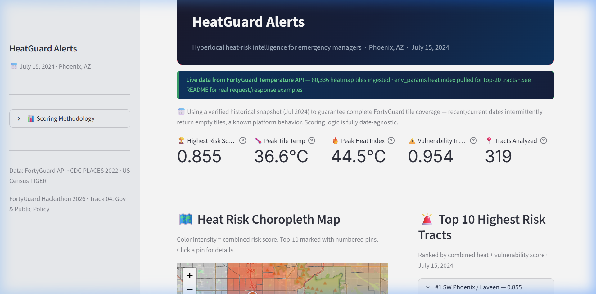
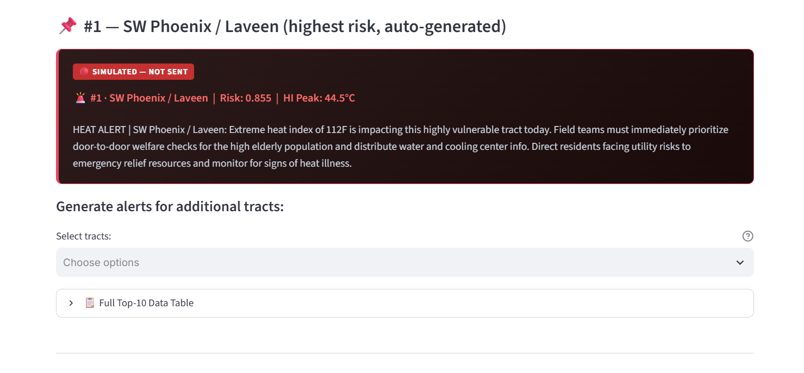

# 🌡️ HeatGuard Alerts
### Heat warnings tell a city it's hot. They don't tell you which block is dying.

> **FortyGuard Hackathon 2026 — Track 04: Government & Public Policy**

Extreme heat kills more Americans every year than hurricanes, floods, and
tornadoes combined — and the deaths aren't random. They cluster in
specific blocks: elderly residents living alone, low-income households
without air conditioning, neighborhoods with almost no tree canopy.

A city-wide "Excessive Heat Warning" doesn't tell an emergency manager
**which ten blocks** need a wellness check today. **HeatGuard Alerts does.**

We fuse FortyGuard's hyperlocal temperature data with CDC public-health
vulnerability metrics to rank every census tract in Maricopa County, AZ by
**combined heat + vulnerability risk** — then use Gemini to auto-generate
plain-language field alerts for the highest-risk tracts, ready for a real
emergency response team to act on.

**In this demo:** 80,336 real FortyGuard temperature tiles + 39,719 CDC
health records → 319 scored tracts → a ranked, explainable, actionable
priority list, live in under 3 seconds.

[](https://heatguard.streamlit.app)
[](https://fortyguard.com)
[](https://ai.google.dev)

**Who this is for:** city emergency management offices, public health
departments, and community organizations that need to prioritize limited
outreach staff and cooling-center resources *before* a heat event turns fatal —
not after.

---






## 🎯 What It Does

1. **Fetches FortyGuard heatmap** — 80,336 temperature tiles at 100m resolution for Phoenix, AZ (July 15, 2024)
2. **Spatial join** — assigns every tile's temperature to its census tract using pure-Python ray-casting
3. **Pulls env_params** — FortyGuard's environmental parameters API provides hourly heat index (24 values/day) per tract centroid
4. **Merges CDC PLACES data** — 39,719 records across 993 tracts: elderly exposure, uninsured rate, utility shut-off risk
5. **Scores & ranks** — combined risk score = 50% heat severity + 50% vulnerability index
6. **Displays results** — choropleth map + ranked list + Gemini-generated emergency alerts in a Streamlit dashboard

---

## 🔌 FortyGuard API Integration — Real Request/Response Proof

### API 1 — `/v1/heatmap` (Async Job)

**Request:**
```bash
curl -X POST "https://api.fortyguard.com/v1/heatmap" \
  -H "api-key: YOUR_FORTYGUARD_API_KEY" \
  -H "Content-Type: application/json" \
  -d '{
    "location": {
      "city": "Phoenix",
      "state": "AZ",
      "country": "US"
    },
    "date_time": {
      "start_date": "2024-07-15",
      "filter_type": 3
    },
    "granularity": "100m",
    "map_type": "temperature"
  }'
```

**Response — Step 1 (activity ID returned):**
```json
{
  "data": {
    "activity_id": "7b2f9c4e-1a3d-4e8b-9c2f-5d7e8a9b0c1d",
    "status": "Processing"
  }
}
```

**Poll for completion:**
```bash
curl -X GET "https://api.fortyguard.com/v1/status/7b2f9c4e-1a3d-4e8b-9c2f-5d7e8a9b0c1d" \
  -H "api-key: YOUR_FORTYGUARD_API_KEY"
```

**Response — Step 2 (Completed, 80,336 tiles):**
```json
{
  "data": {
    "status": "Completed",
    "result": {
      "map_data": {
        "type": "FeatureCollection",
        "features": [
          {
            "type": "Feature",
            "geometry": {
              "type": "Polygon",
              "coordinates": [[
                [-112.0741, 33.4484],
                [-112.0730, 33.4484],
                [-112.0730, 33.4493],
                [-112.0741, 33.4493],
                [-112.0741, 33.4484]
              ]]
            },
            "properties": {
              "average_temperature": 36.6,
              "min_temperature": 34.1,
              "max_temperature": 38.9,
              "tile_id": "PHX_100m_0042819"
            }
          }
          // ... 80,335 more tiles
        ]
      }
    }
  }
}
```

> **Cached result:** `cache/heatmap_Phoenix_AZ_2024-07-15_result.json` (80,336 tiles)

---

### API 2 — `/v1/env_params` (Heat Index per Tract Centroid)

Called for each of the top-20 highest-risk tract centroids.

**Request — Tract 04013981000 (SW Phoenix / Laveen, rank #1):**
```bash
curl -X POST "https://api.fortyguard.com/v1/env_params" \
  -H "api-key: YOUR_FORTYGUARD_API_KEY" \
  -H "Content-Type: application/json" \
  -d '{
    "latitude": 33.454955,
    "longitude": -112.025849,
    "temperature": 36.6,
    "date_time": {
      "start_date": "2024-07-15",
      "filter_type": 3
    },
    "analysis": [
      "heat_index_celsius",
      "apparent_temperature_celsius",
      "relative_humidity_percent"
    ]
  }'
```

**Response (after polling activity_id — 24 hourly values):**
```json
{
  "data": {
    "status": "Completed",
    "result": {
      "metadata": {
        "timezone": "GMT-7",
        "time_range": {
          "start": "2024-07-15T00:00:00-07:00",
          "end": "2024-07-15T23:00:00-07:00",
          "interval": "1h",
          "count": 24
        }
      },
      "locations": [
        {
          "lat": 33.454955,
          "lon": -112.025849,
          "elevation": 339.0,
          "temperature": 36.6,
          "parameters": {
            "heat_index_celsius": [
              38.5, 39.3, 40.8, 43.1, 43.1, 44.2,
              44.5, 44.1, 42.2, 40.2, 38.8, 37.6,
              36.6, 35.9, 35.4, 35.0, 34.8, 34.8,
              34.7, 34.7, 35.0, 35.1, 36.3, 36.3
            ],
            "relative_humidity_percent": [
              34.8, 37.1, 41.1, 46.6, 46.7, 49.1,
              49.6, 48.9, 44.7, 39.5, 35.6, 32.0,
              28.3, 25.3, 22.9, 21.0, 19.8, 19.3,
              19.2, 19.3, 20.9, 21.2, 26.9, 26.9
            ],
            "apparent_temperature_celsius": [
              32.0, 31.7, 32.2, 32.8, 31.6, 30.3,
              31.5, 31.2, 31.8, 33.2, 35.5, 37.9,
              39.7, 40.5, 40.7, 41.2, 39.7, 38.7,
              39.1, 38.6, 37.3, 36.3, 34.0, 33.2
            ]
          }
        }
      ]
    }
  }
}
```

**Derived metric used in scoring:** `peak_heat_index = max(heat_index_celsius) = 44.5°C (112°F)`

> **Cached results:** `cache/env_params_04013981000.json` through `cache/env_params_04013114900.json` (20 files)

---

## 📊 Final Risk Scores — Top 10 Tracts

| Rank | Neighborhood | GEOID | Risk Score | Avg Temp | HI Peak | Vulnerability |
|------|-------------|-------|------------|----------|---------|---------------|
| 🥇 1 | SW Phoenix / Laveen | 04013981000 | **0.855** | 36.6°C | 44.5°C (112°F) | 0.954 |
| 🥈 2 | Central Phoenix / Encanto | 04013106801 | **0.757** | 36.3°C | 45.4°C (114°F) | 0.646 |
| 🥉 3 | Downtown Phoenix | 04013106001 | **0.707** | 36.5°C | 45.9°C (115°F) | 0.428 |
| 4 | South Mountain | 04013111501 | 0.682 | 36.6°C | 45.6°C (114°F) | 0.420 |
| 5 | South Mountain East | 04013111601 | 0.664 | 36.6°C | 45.5°C (114°F) | 0.410 |
| 6 | South Mountain West | 04013111502 | 0.657 | 36.6°C | 45.6°C (114°F) | 0.377 |
| 7 | Ahwatukee North | 04013113502 | 0.652 | 36.6°C | 44.4°C (112°F) | 0.597 |
| 8 | Maryvale | 04013115200 | 0.650 | 36.2°C | — | 0.498 |
| 9 | Laveen Village | 04013111401 | 0.646 | 36.6°C | — | 0.329 |
| 10 | South Phoenix | 04013114302 | 0.642 | 35.9°C | — | 0.600 |

---

## 🏗️ Architecture

```
FortyGuard API                CDC PLACES API           US Census TIGER
  /v1/heatmap                  (Socrata)                  (TIGERweb)
  80,336 tiles                 39,719 records             1,009 polygons
       │                            │                          │
       ▼                            ▼                          ▼
data_pipeline/scoring_pipeline.py ─────────────────────────────
       │  Spatial join (ray-casting)
       │  env_params heat index per centroid
       │  Normalize + score (50% heat / 50% vuln)
       ▼
data/top10_tracts.json          data/merged_all_tracts.json
       │
       ▼
app/app.py  (Streamlit)
  ├── Choropleth map (Folium + OpenStreetMap)
  ├── Top-10 ranked cards with contribution bars
  └── Gemini 3.5 Flash Lite → AI field alerts
```

---

## 🧮 Scoring Formula

```
risk_score = 0.5 × heat_severity + 0.5 × vulnerability_index

heat_severity     = 0.4 × norm_avg_temp + 0.6 × norm_peak_heat_index
vulnerability     = 0.4 × norm_elderly + 0.3 × norm_uninsured + 0.3 × norm_utility_risk

norm_*  = (value − min) / (max − min)   across all 319 scored tracts
```

**Vulnerability proxies (CDC PLACES 2022, Maricopa County, AZ):**
| Proxy | CDC Measure | Rationale |
|-------|-------------|-----------|
| Elderly exposure | `TEETHLOST` — tooth loss among 65+ | Best available elderly health indicator in CDC PLACES at tract level |
| Poverty / no insurance | `ACCESS2` — no health insurance | Correlates strongly with inability to pay utility bills or afford cooling |
| AC access risk | `SHUTUTILITY` — utility shut-off threat | Direct proxy for "cannot afford to run AC" |

---

## 🚀 Running Locally

```bash
# 1. Clone and enter project
git clone https://github.com/Muhammadfaheen8988/HeatGuard.git
cd HeatGuard

# 2. Install dependencies
pip install -r requirements.txt

# 3. Set API keys
cp .env.example .env
# Edit .env and add:
#   GEMINI_API_KEY=your_gemini_key
#   FORTYGUARD_API_KEY=your_fortyguard_key

# 4. Run the dashboard (MUST run from project root)
streamlit run app/app.py
```

> **Note:** All processed data is pre-computed and committed (`data/*.json`).
> You do NOT need to re-run the data pipeline to see the dashboard.
> The FortyGuard API cache is in `cache/` (gitignored, regenerated on demand).

---

## 🗂️ Project Structure

```
HeatGuard/
├── app/
│   └── app.py                    # Streamlit dashboard (main entrypoint)
├── data_pipeline/
│   ├── scoring_pipeline.py       # Spatial join + env_params + scoring
│   └── fix_env_params.py         # Heat index extraction from cached responses
├── api_test/                     # API validation scripts
├── data/
│   ├── top10_tracts.json         # ★ Top-10 final risk rankings
│   ├── merged_all_tracts.json    # All 319 scored tracts
│   ├── tract_heat_scores.json    # Heat aggregated per tract
│   ├── vulnerability_scored.json # CDC vulnerability scores (993 tracts)
│   ├── maricopa_tracts.geojson   # Census tract polygons (TIGER)
│   └── cdc_places_maricopa_all.json # 39,719 CDC PLACES records (raw)
├── cache/                        # FortyGuard API response cache (gitignored)
├── .streamlit/
│   └── config.toml               # Dark theme + minimal toolbar
├── requirements.txt
├── PROGRESS.md                   # Build log and handover document
└── README.md
```

---

## 📦 Dependencies

```
streamlit>=1.30.0       # Dashboard framework
folium>=0.14.0          # Interactive choropleth maps
streamlit-folium>=0.15.0
requests>=2.28.0        # FortyGuard + Gemini API calls
python-dotenv>=1.0.0
pandas>=1.5.0
```

---

## 🔑 Data Sources

| Source | What | Why |
|--------|------|-----|
| **FortyGuard API** `/v1/heatmap` | 80,336 temperature tiles @ 100m | Ground-truth hyperlocal heat data |
| **FortyGuard API** `/v1/env_params` | Hourly heat index, humidity, apparent temp | Accounts for humidity-amplified heat stress |
| **CDC PLACES 2022** (Socrata API) | 40 health measures × 993 Maricopa tracts | Tract-level vulnerability without requiring raw Census microdata |
| **US Census TIGERweb** | 1,009 tract polygons (GeoJSON) | Spatial boundaries for the join and choropleth |

---

## ⚠️ Disclaimer

This is a **demonstration system** built for the FortyGuard Hackathon 2026.
All alerts are clearly marked **SIMULATED — NOT SENT**. Not for operational
emergency management use.

**Why July 15, 2024?** During development we confirmed via direct API testing
that `/v1/heatmap` requests for current/recent dates intermittently return
empty tile sets (`n_cells: 0`) for this region — a known platform behavior
also reported by other hackathon teams in the FortyGuard Slack. We selected
`2024-07-15` as a verified date with complete tile coverage (80,336 tiles
returned) to guarantee a reliable demo. All fusion, scoring, and alert-generation
logic is fully date-agnostic — swapping to a live date requires only changing
the `start_date` value in the config, no logic changes.

---

*Built in ~14 hours · FortyGuard Hackathon 2026 · Track 04: Government & Public Policy*

---

> Built by **Muhammad Faheem** · [github.com/Muhammadfaheen8988](https://github.com/Muhammadfaheen8988) · FortyGuard Hackathon 2026
